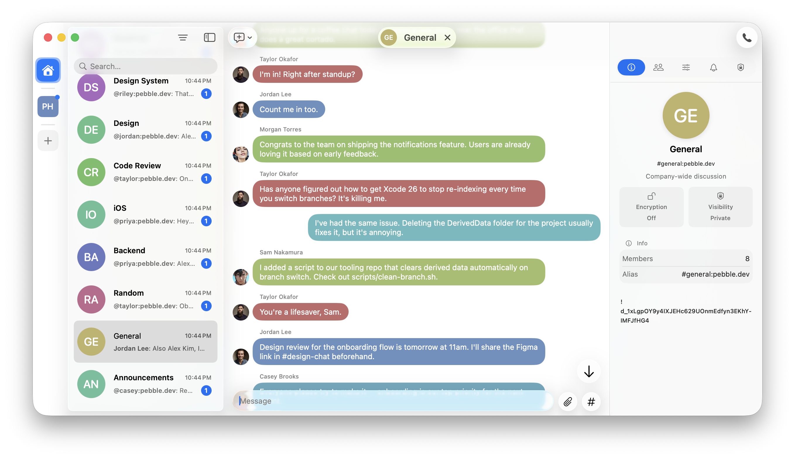

Relay - All the power of Matrix. None of the complexity.



A native macOS chat app built with SwiftUI that wraps the [Matrix Rust SDK](https://github.com/matrix-org/matrix-rust-sdk) via UniFFI-generated Swift bindings. Relay aims to feel like a first-class Mac app — fast, simple, and user-friendly — while speaking the Matrix protocol under the hood.

## Feature Overview

- **Room list & navigation** — browse joined rooms with unread counts, avatars, sorting, and filtering.
- **Rich timeline** — text, emote, notice, image, video, audio, and file messages with proper grouping, date headers, sender avatars, and big emoji for emoji-only messages.
- **Rich text rendering** — messages display formatted bodies with interactive, clickable mentions.
- **Message editing** — edit previously sent messages.
- **Message redaction** — delete messages.
- **Reactions** — toggle emoji reactions via context menu, emoji picker, or long-press.
- **Replies** — swipe on a message to reply, rendered as overlapping bubbles with click-to-jump.
- **Pin messages** — pin and unpin messages, view pinned messages, and jump to them in the timeline.
- **URL previews** — link previews displayed as standalone cards alongside messages.
- **Unread markers** — a "New" divider appears at the first unread message with jump-to support.
- **Attachments** — stage images and files before sending via drag-and-drop, paste, or the attach button.
- **GIF search** — search and send GIFs via GIPHY.
- **Username autocomplete** — mention users with inline suggestions while composing.
- **Typing indicators** — see who is currently typing in a room.
- **Room directory & room creation** — discover and join public rooms or create new ones.
- **Room details** — view and inspect room name, topic, and members.
- **Deep links** — handle `matrix:` URLs and `matrix.to` links to open rooms directly.
- **Direct messages** — start a DM with any user from their profile.
- **Infinite scrollback** — paginate backwards through history with a single click.
- **Auto-scroll** — the timeline stays pinned to the bottom for new messages, but won't interrupt you if you've scrolled up.
- **Session verification** — verify new sessions with a redesigned in-app flow.
- **Keychain-backed sessions** — login credentials are stored securely in the macOS Keychain.

## Activity Log

Relay includes a built-in Activity Log window for debugging sync and connection
issues. Open it from **Window > Activity Log** (Opt+Cmd+A).

The log captures real-time diagnostic events from the service layer as they
happen, providing an "under the hood" view into the sync pipeline, room list
management, and timeline diff processing. Events accumulate in a 10,000-entry
ring buffer from app launch — the window is purely a viewer, so you won't miss
events that occurred before opening it.

### Event Categories

| Category | Icon | What it captures |
|---|---|---|
| **Sync** | `arrow.triangle.2.circlepath` | Sync service state transitions (idle, syncing, running, offline, error), sleep/wake handling, reconnect scheduling with backoff delays. |
| **Room List** | `list.bullet` | SDK room list diff batches (append, set, remove, reset, etc.) with before/after entry counts, room info updates with unread count deltas, and room list re-sorts. |
| **Timeline** | `text.bubble` | Per-room timeline diff batches with type breakdown and changed-index tracking, message rebuild results, stale generation discards, and pagination status changes. |
| **Network** | `network` | Network path changes from `NWPathMonitor` (connectivity lost/restored). |
| **Auth** | `person.badge.key` | Session restore results (success, offline with saved session, failure) and login state changes. |
| **Media** | `photo` | Reserved for future media loading instrumentation. |

### Severity Levels

| Level | Meaning |
|---|---|
| **Debug** | Routine operational detail — diff batches, room info updates, pagination events. High volume during normal operation. |
| **Info** | Significant lifecycle milestones — sync started/running, network restored, session restored. |
| **Warning** | Conditions that may indicate problems — network lost, SDK reported offline, sync did not reach running state. |
| **Error** | Failures — sync service terminated, SDK sync error, session restore failure. |

### Interpreting Common Event Sequences

**Normal startup:**
```
[Auth/Info]      Session restored
[Sync/Info]      Starting sync pipeline
[Sync/Info]      Starting sync
[Sync/Info]      Sync state: running
[Sync/Info]      Initial sync reached running state
[Sync/Info]      Sync manager started, starting client observation
[Sync/Info]      Room list manager started
[RoomList/Debug] 42 entry update(s): 0 → 42 entries    (detail: "reset(42)")
[RoomList/Debug] Room list rebuilt: 42 rooms sorted
[Sync/Info]      Space list manager started — sync pipeline complete
```

**Incoming message (timeline active):**
```
[Timeline/Debug] 1 diff(s) in #room:server: 25 → 26 items    (detail: "pushBack")
[Timeline/Debug] Messages updated in #room:server: 21 messages (v5)
```

**Network interruption and recovery:**
```
[Network/Warning]  Network connectivity lost
[Sync/Warning]     Network lost — stopping sync service
[Network/Info]     Network connectivity restored
[Sync/Info]        Network restored — restarting sync service
[Sync/Info]        Sync state: running
[RoomList/Info]    Room list restarted with new sync service
```

**Reconnect with backoff (homeserver unreachable):**
```
[Sync/Error]    SDK sync error
[Sync/Info]     Scheduling reconnect attempt #1    (detail: "Delay: 1.0s ...")
[Sync/Info]     Scheduling reconnect attempt #2    (detail: "Delay: 3.0s ...")
```

**Sleep/wake cycle:**
```
[Sync/Info]     System sleep — tearing down sync service
[Sync/Info]     System wake — rebuilding sync service
[Sync/Info]     Sync state: running
```

### Debugging Missing Messages

The Activity Log is designed to help pinpoint where messages are lost in the
pipeline. When investigating a missing message:

1. **Filter by room** — use the Room toolbar menu to scope events to the
   affected room.
2. **Check timeline diffs** — look for `Timeline/Debug` events showing diff
   batches. Each incoming message should produce a `pushBack` diff and a
   subsequent "Messages updated" event. If the diff arrives but the message
   count doesn't increase, the message mapper may have filtered it (e.g. a
   state event or date divider, not a user message).
3. **Check for stale generation discards** — a "Rebuild discarded (stale
   generation)" event means a mapping result was thrown away because a newer
   diff batch superseded it. This is normal under heavy load but could cause
   a brief delay in message appearance.
4. **Check room list updates** — `RoomList/Debug` events show unread count
   transitions. If the SDK reports an unread count increase but the timeline
   shows no new diff, the message may not yet have been delivered to the
   timeline listener.
5. **Check sync state** — any `Sync/Warning` or `Sync/Error` events around
   the time of the missing message may indicate that sync was interrupted.

### Toolbar Controls

- **Auto-scroll** — when enabled (filled arrow icon), the list follows new
  events. When disabled (slash icon), the list stays at your scroll position.
- **Categories** — toggle which event categories are visible.
- **Severity** — set the minimum severity level to display.
- **Room** — filter events to a specific room.
- **Clear** — empty the event buffer.
- **Inspector** — toggle the detail panel showing full event metadata.

## Roadmap

- 🧵 Thread support

# Try It Out

Relay is currently delivering prerelease builds through Test Flight. Join the
[Matrix room](https://matrix.to/#/#relayapp:matrix.org) to get an invite URL.

# Get Involved

Join us in the Matrix room to ask questions, discuss ideas, or just say hello:

[#relayapp:matrix.org](https://matrix.to/#/#relayapp:matrix.org)

# License

Code is licensed under the Apache 2.0 license. See the [LICENSE](./LICENSE) file for details.
Digital artwork is licensed under the Creative Commons Attribution-ShareAlike 4.0 International license. See the [LICENSE-CC-BY-SA](./LICENSE-CC-BY-SA) for details.

---

Made with ❤️. Fueled by ☕️ and 🤖.
